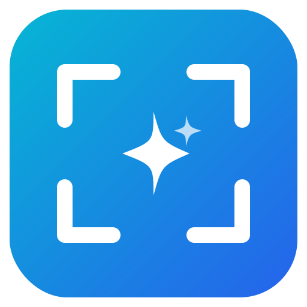

<p align="center">
  
</p>

<h1 align="center">Gaze</h1>

<p align="center">
  <strong>Capture for AI — スクリーンショットをLLMに最速で届けるツール</strong>
</p>

<p align="center">
  <a href="#"></a>
  <a href="#license"></a>
  <a href="#"></a>
</p>

<!-- TODO: デモGIF/スクリーンショットを追加 -->

---

## Gaze とは？

スクリーンショットは「人に見せるもの」から「AIに理解させるもの」へ変わりつつあります。しかし、既存のスクリーンショットツール（CleanShot X、Shottr等）はすべて人間向けに最適化されており、LLMへの入力ワークフローは手動で断片的なままです。

Gaze はこのギャップを埋めます。1キーストロークで画面をキャプチャし、LLMプロバイダに最適な形式へ自動変換してクリップボードへ。あとは Claude、ChatGPT、Cursor など好きなAIツールにペーストするだけです。

## 機能

- **LLM最適化出力** — プロバイダ仕様（Claude / GPT-4o / Gemini）に合わせた自動リサイズ・圧縮・フォーマット変換
- **ワンキーストローク** — キャプチャ → 最適化 → クリップボードをショートカット一発で完結
- **エリア選択** — 必要な部分だけを正確にキャプチャ。不要なUIノイズやトークンの無駄を排除
- **トークン数プレビュー** — LLMに送信する前に、推定トークンコストを確認可能
- **軽量** — Tauri v2 + Rust で構築。15MB以下、省メモリ。Electron系の1/10のサイズ
- **クロスプラットフォーム** — 単一コードベースで macOS / Windows に対応

### 今後の予定

- **MCP Server** — AIエージェントからプログラマティックにキャプチャを取得
- **OCRモード** — 画像の代わりにテキスト抽出でトークンを大幅節約
- **バーストモード** — 連続キャプチャでマルチステップの操作手順を一括送信
- **GIF / 動画キャプチャ** — 短い操作を録画し、重要フレームを自動抽出
- **スマートリダクション** — メールアドレスやAPIキー等の機密情報を自動マスク
- **アノテーション** — 矢印、矩形、テキスト、ブラー等の注釈ツール

## LLMプロバイダ対応

| プロバイダ | 最適解像度 | トークンコスト (1000×1000px) | 対応フォーマット |
|-----------|-----------|--------------------------|----------------|
| Claude | 1568px 長辺 | ~1,334 トークン | JPEG, PNG, GIF, WebP |
| GPT-4o | 2048px / 512px タイル | ~765 トークン | JPEG, PNG, WebP, GIF |
| Gemini | 768px タイル | ~1,290 トークン | PNG, JPEG, WebP, HEIC |

Gaze がターゲットプロバイダに最適な解像度・フォーマット・圧縮率を自動選択します。

## インストール

> Gaze は初期開発段階です。ビルド済みバイナリは近日公開予定。

### ソースからビルド

**必要なもの:**
- [Rust](https://rustup.rs/)（最新stable）
- [Tauri CLI](https://v2.tauri.app/reference/cli/)（`cargo install tauri-cli`）

```bash
# リポジトリをクローン
git clone https://github.com/RQ-Akiyoshi/gaze.git
cd gaze

# CLI のヘルプ
cargo run -p gaze-cli -- --help

# 開発モードで起動
cargo tauri dev

# CLI バイナリをビルド
cargo build -p gaze-cli

# プロダクションビルド
cargo tauri build
```

> **macOS の場合:** ターミナルアプリに画面収録の権限を付与する必要があります。
> システム設定 → プライバシーとセキュリティ → 画面収録とシステムオーディオ録音 → ターミナルを追加

### CLI

```bash
# フルスクリーンを JSON で取得
cargo run -p gaze-cli -- capture

# エリア選択して Claude 向けに最適化したファイルを書き出す
cargo run -p gaze-cli -- capture --mode area --provider claude --output /tmp/capture.webp

# 対象一覧
cargo run -p gaze-cli -- list displays
cargo run -p gaze-cli -- list windows

# 既存画像を最適化
cargo run -p gaze-cli -- optimize screenshot.png --provider gpt --output /tmp/optimized.png
```

## クイックスタート

1. **起動** — Gaze はメニューバーに常駐します
2. **キャプチャ** — グローバルショートカットでエリア選択を起動
3. **選択** — キャプチャしたい範囲をドラッグで指定
4. **ペースト** — 最適化済みの画像がクリップボードに入っています。`Cmd+V` でLLMへ

<!-- TODO: ワークフローのスクリーンショットまたはGIFを追加 -->

## アーキテクチャ

```
gaze/
├── src-tauri/               # Rust バックエンド (Tauri v2)
│   ├── src/
│   │   ├── commands/        # Tauri IPC コマンド
│   │   ├── capture/         # スクリーンキャプチャエンジン
│   │   ├── pipeline/        # 画像最適化パイプライン
│   │   └── tray.rs          # システムトレイ統合
│   └── Cargo.toml
├── crates/
│   ├── snapforge-capture/   # プラットフォームネイティブキャプチャ
│   ├── snapforge-pipeline/  # 画像処理 & LLM最適化
│   ├── snapforge-core/      # GUI/CLI 共通のキャプチャ処理
│   └── gaze-cli/            # CLI バイナリ
├── public/                  # 静的フロントエンドアセット
│   └── preview.html         # プレビューポップアップ (自己完結型HTML)
├── docs/                    # 戦略・設計仕様・ガイドライン
└── Cargo.toml
```

**主要技術:**
- **Tauri v2** — 軽量デスクトップフレームワーク (Rust + WebView)
- **scap** — ネイティブスクリーンキャプチャ (macOS: ScreenCaptureKit, Windows: Windows.Graphics.Capture)
- **image / gifski / webp** — 画像処理パイプライン

## 開発

```bash
cargo tauri dev       # 開発モード
cargo tauri build     # プロダクションビルド
cargo clippy          # Rust リンター
cargo test            # Rust テスト
cargo fmt             # Rust フォーマッター
```

## ロードマップ

- [x] オーバーレイ付きエリアキャプチャ
- [x] キャプチャ後のプレビュー (ファイルサイズ・トークン数表示)
- [ ] LLMプロバイダ別の画像最適化
- [ ] ウィンドウキャプチャ
- [ ] グローバルショートカットのカスタマイズ
- [ ] アノテーションエディタ (矢印、矩形、テキスト、ブラー)
- [ ] OCRテキスト抽出モード
- [ ] バーストモード (連続キャプチャ)
- [ ] GIF / 短時間動画キャプチャ
- [ ] MCP Server 統合 (AIエージェント連携)
- [ ] クラウド同期とキャプチャ履歴

## コントリビュート

コントリビュートを歓迎します！変更を提案する場合は、まず Issue を作成してください。

```bash
# PR提出前の品質チェック
cargo fmt --all -- --check && cargo clippy && cargo test
```

## ライセンス

[MIT](LICENSE)

---

<p align="center">
  Built with <a href="https://v2.tauri.app/">Tauri v2</a> ·
  Inspired by <a href="https://cap.so">Cap</a>
</p>
